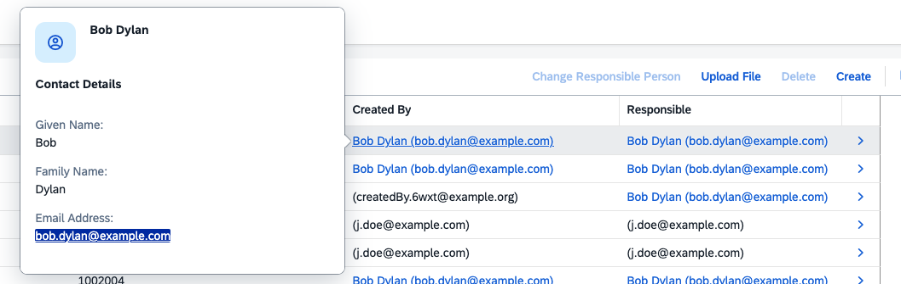

# cap-user-info

CDS plugin that tracks created/modified user details on managed entities.

## Install

```bash
npm install cap-user-info
```

## Usage

```cds
using { UserTracked, UserInfo } from 'cap-user-info';

entity MyEntity : cuid, UserTracked {
  // your fields
}
```

The plugin auto-registers `.after("CREATE" | "UPDATE")` handlers on every
application-service entity that includes the `UserTracked` aspect. Each
handler UPSERTs the current user (`req.user`) into `UserInfo`. The
associations `_toCreatedUserInfo` / `_toModifiedUserInfo` resolve via
`createdBy` / `modifiedBy`.

## How it works

`UserTracked` extends `managed`, so consuming entities automatically
inherit `createdBy` / `modifiedBy` (and the corresponding timestamps):

It will add a quickview to the createdBy and modifiedBy to show the user details. The details are stored from the req.user upon changes to the entity.

```cds
aspect UserTracked : managed { ... }
```

This means no extra `managed` declaration is required on the consuming
entity — including `UserTracked` is enough.


## Extending the quickview

You can extend the UserInfo to add more data into the quickview by adding to the fieldgroup in a cds file.

``` cds
  // Change the quickview
extend cap.userinfo.UserInfo with
  @UI.FieldGroup: {Data: [
    // Leave the original properties
    {
      $Type: 'UI.DataField',
      Value: GivenName
    },
    {
      $Type: 'UI.DataField',
      Value: FamilyName
    },
    {
      $Type: 'UI.DataField',
      Value: Email
    },
    // your new field
    {
      $Type: 'UI.DataField',
      Value: Department
    }, 
  ]}

  //Change the 
  @UI.HeaderInfo     : {
    ImageUrl    : '',
    TypeImageUrl: 'sap-icon://employee',
    Title       : {
        Value: FullName,
    },
    TypeName    : '',
}
  {
    // your new field iin the entity
    Department : String @title                        : 'Department';
  }
```

Then register your event handler to populate the data. It's important this piece of code isn't added within your srv.init method. It needs to be in the root context.
``` javascript
cds.on("served", () => {
  const { db } = cds.services;
  const { UserInfo } = cds.entities("cap.userinfo");

  //Register the handler for the Upsert
  db.before("UPSERT", UserInfo, async (req) => {
    //Change the data
    req.data.Department = "Admin";
  });
});
```
